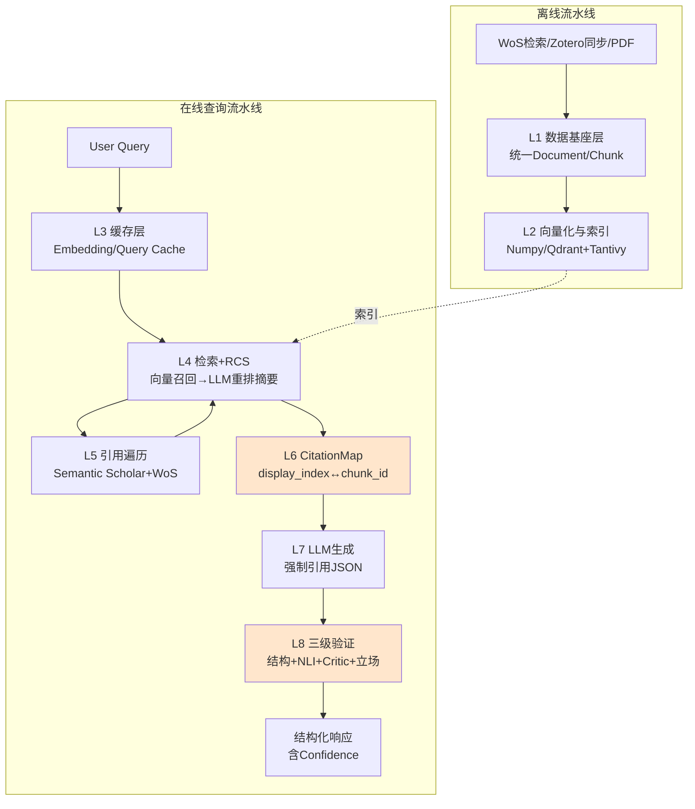
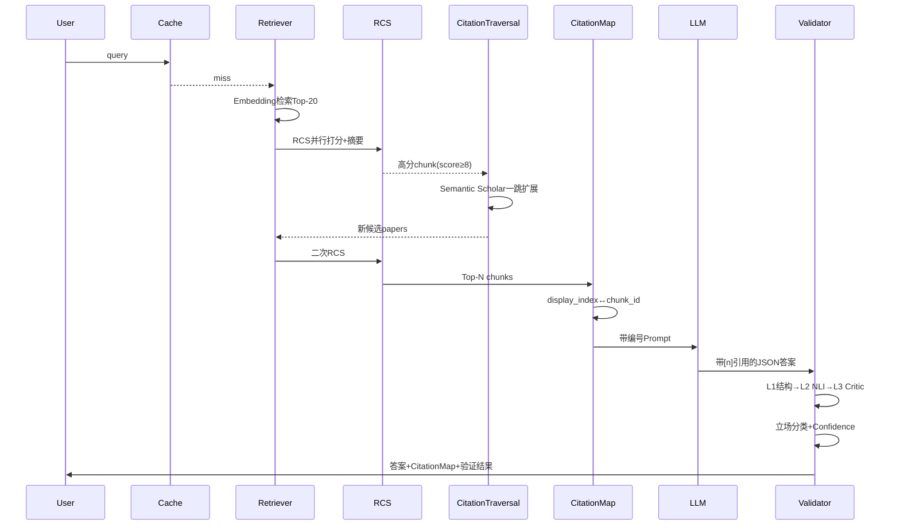
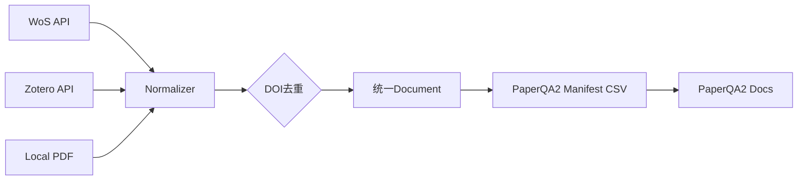
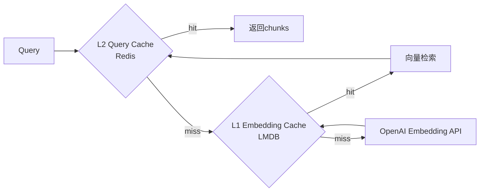
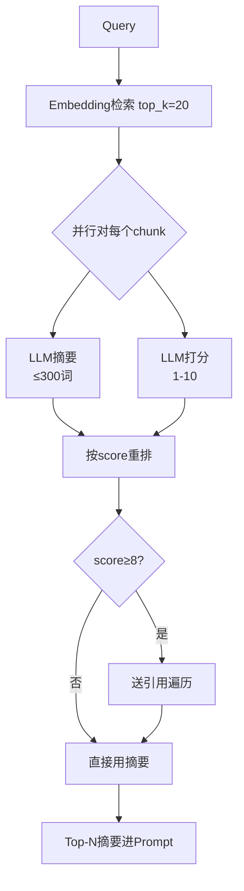
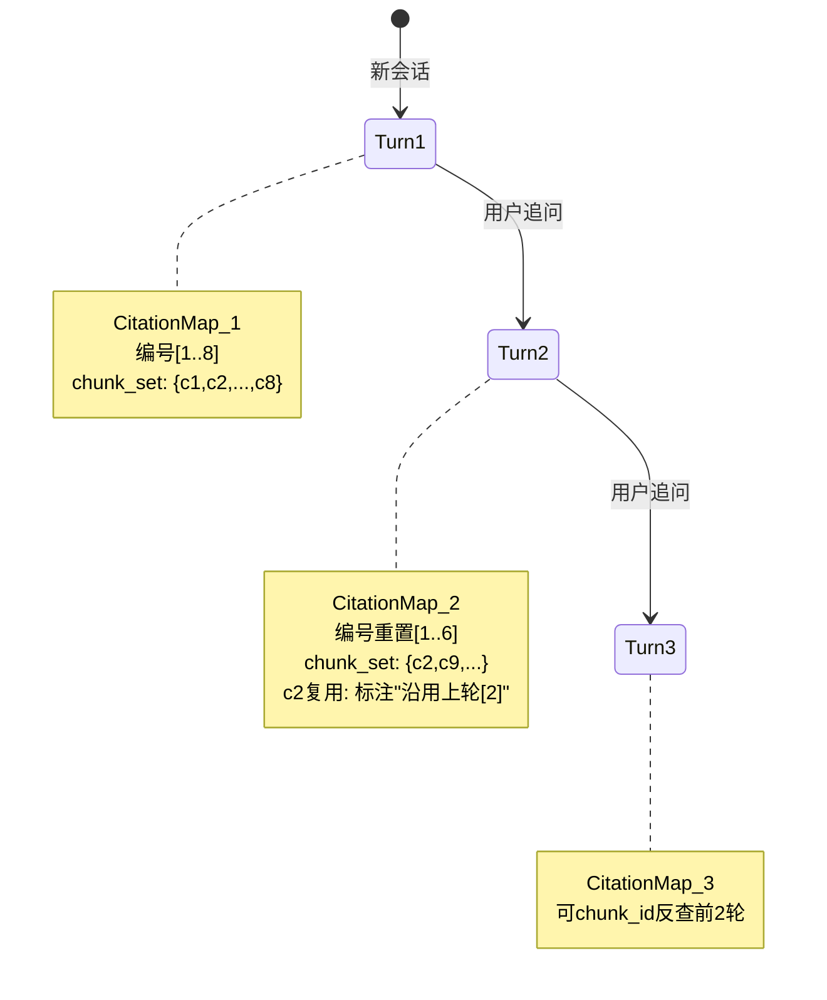
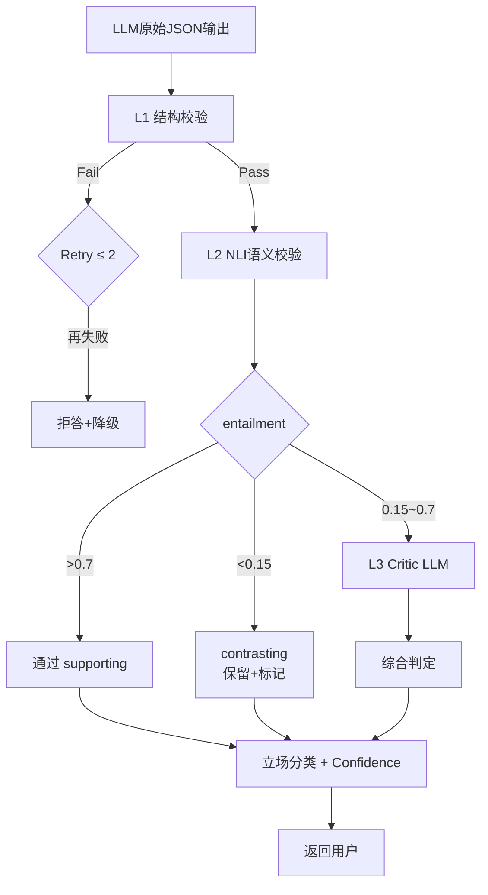

下面是 v3 最终版手册，直接复制到 `docs/DEV_GUIDE_v3.md` 即可作为团队开发规范。核心策略已明确：**基于 PaperQA2 源码二次开发，面向英文文献，在其之上叠加三项差异化创新（WoS/Zotero 原生集成 + 三级引用验证 + 立场分类 + Confidence Score）。**

---

# **Literature Citation-RAG · 开发规范 v3.0**

> **项目代号：** Literature Citation-RAG (LCR)
> **文档版本：** v3.0 (Final)
> **基础框架：** Fork of [PaperQA2](https://github.com/Future-House/paper-qa) (Apache 2.0)
> **上游数据源：** [literature-automation-system](https://github.com/YanSH258/literature-automation-system)
> **目标语种：** 英文学术文献为主
> **适用范围：** 团队开发规范 / 论文 Method 章节骨架
> **最后更新：** 2026-04-21

---

## **目录**

- [1. 项目定位与差异化战略](#1-项目定位与差异化战略)
- [2. 系统总体架构](#2-系统总体架构)
- [3. 基于 PaperQA2 的复用策略](#3-基于-paperqa2-的复用策略)
- [4. 核心数据契约](#4-核心数据契约)
- [5. 分层开发规范](#5-分层开发规范)
  - [5.1 L1 · 数据基座层（上游对接）](#51-l1--数据基座层上游对接)
  - [5.2 L2 · 向量化与索引层（复用 PaperQA2）](#52-l2--向量化与索引层复用-paperqa2)
  - [5.3 L3 · 缓存层（新增）](#53-l3--缓存层新增)
  - [5.4 L4 · 检索层：RCS 流水线（复用 + 增强）](#54-l4--检索层rcs-流水线复用--增强)
  - [5.5 L5 · 引用遍历层（复用 + 适配）](#55-l5--引用遍历层复用--适配)
  - [5.6 L6 · 引用映射层（自研核心）](#56-l6--引用映射层自研核心)
  - [5.7 L7 · 生成层（复用 + 硬约束）](#57-l7--生成层复用--硬约束)
  - [5.8 L8 · 三级引用验证层（自研核心）](#58-l8--三级引用验证层自研核心)
- [6. 开发里程碑与验收标准](#6-开发里程碑与验收标准)
- [7. 技术栈与依赖清单](#7-技术栈与依赖清单)
- [8. 风险登记与预警](#8-风险登记与预警)
- [9. 论文写作策略](#9-论文写作策略)
- [10. 附录](#10-附录)

---

## **1. 项目定位与差异化战略**

### **1.1 项目定位**

Literature Citation-RAG（LCR）是一个**面向英文科研文献的高精度可溯源问答系统**。采取「**站在巨人肩膀上**」的策略——基于 FutureHouse 的开源 PaperQA2（8.4k ⭐, Apache 2.0）进行二次开发，在其已被 LitQA2 基准验证为 SOTA 的核心能力之上，叠加三项系统性创新。

### **1.2 三大差异化优势（论文核心卖点）**

| # | 优势 | 对标 PaperQA2 | 论文 Contribution |
|---|---|---|---|
| 1 | **WoS + Zotero 原生集成** | PaperQA2 需用户手动放 PDF | 闭环的"发现→入库→问答"工作流 |
| 2 | **三级引用验证流水线** | PaperQA2 仅靠 Prompt 约束引用 | 结构校验 + NLI 语义校验 + Critic LLM,可量化 |
| 3 | **引用立场分类 + Confidence Score** | PaperQA2 引用是二值的 | 输出 supporting/mentioning/contrasting 三分类与 0-1 置信度 |

### **1.3 三条不可妥协的设计红线**

1. **数据一致性红线**：chunk_id 全局唯一、终身不变。
2. **引用鲁棒性红线**：未通过 L1+L2 验证的引用不得返回。
3. **开源合规红线**：严守 Apache 2.0 协议，PaperQA2 修改必须回注 LICENSE 和 NOTICE。

---

## **2. 系统总体架构**

### **2.1 八层架构总览**



> **橙色层为自研核心**，其余层基于 PaperQA2 复用或增强。

### **2.2 在线查询时序图**



---

## **3. 基于 PaperQA2 的复用策略**

### **3.1 代码复用清单（降低 60% 开发量）**

| 模块 | PaperQA2 源码位置 | 复用方式 | 改造工作量 |
|---|---|---|---|
| Docs/Text/Context 数据类 | `src/paperqa/types.py` | 直接复用 | 0 |
| PDF 解析（PyMuPDF/Grobid） | `src/paperqa/readers.py` | 直接复用 | 0 |
| RCS 摘要重排 | `src/paperqa/docs.py::aget_evidence` | 配置化使用 | 低 |
| 元数据获取（Crossref/S2/Unpaywall） | `src/paperqa/clients/` | 直接复用 | 0 |
| Tantivy 全文索引 | `src/paperqa/agents/search.py` | 直接复用 | 0 |
| LiteLLM 多模型支持 | 通过 `Settings` | 配置化使用 | 0 |
| 引用遍历工具 | 官方暂未完全开源,需按论文实现 | **需自研** | 中 |
| CitationMap（双层 ID） | **PaperQA2 无此设计** | **完全自研** | 高 |
| 三级验证流水线 | **PaperQA2 无此设计** | **完全自研** | 高 |
| 立场分类 + Confidence | **PaperQA2 无此设计** | **完全自研** | 中 |
| WoS/Zotero 对接 | **PaperQA2 无此设计** | **完全自研** | 中 |
| 前端 UI | **PaperQA2 是 CLI/SDK** | **完全自研** | 高 |

### **3.2 项目工程结构**

```
literature-citation-rag/
├── LICENSE                  # Apache 2.0 (继承自PaperQA2)
├── NOTICE                   # 必须保留PaperQA2归属
├── pyproject.toml
├── src/
│   └── lcr/
│       ├── __init__.py
│       ├── ingest/          # L1 自研 WoS/Zotero对接
│       │   ├── wos.py
│       │   ├── zotero.py
│       │   └── normalizer.py
│       ├── cache/           # L3 自研缓存层
│       │   ├── embedding_cache.py    # LMDB
│       │   └── query_cache.py        # Redis
│       ├── retrieval/       # L4 基于PaperQA2包装
│       │   ├── rcs_wrapper.py
│       │   └── hybrid_search.py
│       ├── traversal/       # L5 自研引用遍历
│       │   └── citation_graph.py
│       ├── citation/        # L6 自研CitationMap
│       │   ├── citation_map.py
│       │   └── display_index.py
│       ├── generation/      # L7 基于PaperQA2定制Prompt
│       │   └── prompts.py
│       ├── validation/      # L8 自研三级验证
│       │   ├── structural.py
│       │   ├── nli_validator.py
│       │   ├── critic_validator.py
│       │   └── stance_classifier.py
│       ├── orchestrator.py  # 主编排入口
│       └── api/             # FastAPI接口
│           └── server.py
└── tests/
```

### **3.3 复用的具体代码模式**

**模式 1：直接使用 PaperQA2 的 Docs + Settings**

```python
# src/lcr/retrieval/rcs_wrapper.py
from paperqa import Docs, Settings
from paperqa.agents.main import agent_query

class LCRRetriever:
    """包装PaperQA2的Docs,保留RCS能力,注入自研逻辑"""
    
    def __init__(self, paper_directory: str):
        self.settings = Settings(
            llm="gpt-4o-2024-11-20",
            summary_llm="gpt-4o-mini",  # RCS用便宜模型
            answer={"evidence_k": 20, "answer_max_sources": 8},
            agent={"index": {"paper_directory": paper_directory}},
        )
        self.docs = Docs()
    
    async def retrieve_with_rcs(self, query: str) -> list:
        """调用PaperQA2的aget_evidence,拿到RCS后的chunks"""
        session = await self.docs.aget_evidence(query, settings=self.settings)
        return session.contexts  # 带RCS评分的chunks
```

**模式 2：继承扩展 PaperQA2 的 Prompt 模板**

```python
# src/lcr/generation/prompts.py
from paperqa.prompts import qa_prompt as base_qa_prompt

LCR_QA_PROMPT = base_qa_prompt + """

ADDITIONAL HARD CONSTRAINTS:
1. Every declarative sentence MUST end with citation markers [n].
2. Unreferenced statements will be rejected by the validator.
3. Output strict JSON with keys: answer, used_citations, confidence.
"""
```

---

## **4. 核心数据契约**

### **4.1 Chunk 数据模型（扩展 PaperQA2 的 Text）**

```python
from dataclasses import dataclass, field
from paperqa.types import Text  # 复用PaperQA2基础类

@dataclass(frozen=True)
class LCRChunk:
    """LCR扩展的Chunk,兼容PaperQA2.Text"""
    chunk_id: str              # 格式: "{doc_id}#{seq:04d}"
    doc_id: str                # DOI优先,无则UUID
    text: str
    section: str               # 基于Grobid章节识别
    page: int
    char_start: int
    char_end: int
    # 元数据快照(冗余,保证可复现)
    metadata: dict = field(default_factory=dict)
    # PaperQA2的RCS产物
    rcs_score: float | None = None
    rcs_summary: str | None = None
    
    @classmethod
    def from_paperqa_text(cls, text: Text, seq: int) -> "LCRChunk":
        """从PaperQA2的Text对象转换"""
        return cls(
            chunk_id=f"{text.doc.dockey}#{seq:04d}",
            doc_id=text.doc.dockey,
            text=text.text,
            section=text.name,  # PaperQA2的name字段
            page=getattr(text, "page", 0),
            char_start=0, char_end=len(text.text),
            metadata={
                "title": text.doc.title,
                "authors": text.doc.authors,
                "year": text.doc.year,
                "doi": text.doc.doi,
                "journal": getattr(text.doc, "journal", ""),
            },
        )
```

### **4.2 CitationMap 数据结构**

```python
@dataclass
class CitationEntry:
    display_index: int         # UI层编号,每轮可变
    chunk_id: str              # 真实引用锚点,永不变
    doc_id: str
    snippet: str               # 前端悬浮卡片用
    metadata: dict
    rcs_score: float           # 从PaperQA2继承

@dataclass
class CitationMap:
    session_id: str
    turn_id: int
    entries: dict[int, CitationEntry]
    reverse_lookup: dict[str, int]
```

### **4.3 最终响应协议**

```json
{
  "answer_text": "Ni doping significantly enhances HAP basicity [1][3]. However, conflicting evidence exists [5].",
  "citations": [
    {
      "display_index": 1,
      "chunk_id": "10.1021-jacs.3c01234#0007",
      "doc_id": "10.1021/jacs.3c01234",
      "title": "...", "authors": ["..."], "year": 2023,
      "doi": "10.1021/jacs.3c01234",
      "section": "Results", "page": 5,
      "snippet": "...", "pdf_url": "...",
      "rcs_score": 9.0
    }
  ],
  "sentence_level_validation": [
    {
      "sentence": "Ni doping significantly enhances HAP basicity [1][3]",
      "citations": [
        {"display_index": 1, "stance": "supporting", "confidence": 0.91, "nli_entails": 0.89},
        {"display_index": 3, "stance": "supporting", "confidence": 0.76, "nli_entails": 0.72}
      ]
    },
    {
      "sentence": "However, conflicting evidence exists [5]",
      "citations": [
        {"display_index": 5, "stance": "contrasting", "confidence": 0.83, "nli_entails": 0.12}
      ]
    }
  ],
  "overall_confidence": 0.84,
  "co_citation_suggestions": {"1": [7, 9]}
}
```

---

## **5. 分层开发规范**

### **5.1 L1 · 数据基座层（上游对接）**

**职责：** 连接 `literature-automation-system`,把 WoS/Zotero/PDF 数据转为 PaperQA2 可识别的 Docs 格式。

#### **5.1.1 WoS / Zotero 数据归一化**



**关键代码（复用 PaperQA2 的 Manifest 机制）：**

```python
# src/lcr/ingest/normalizer.py
from paperqa import Doc

def wos_record_to_paperqa_doc(record: dict, pdf_path: str) -> Doc:
    """将WoS记录转换为PaperQA2的Doc对象"""
    return Doc(
        docname=record["doi"].replace("/", "-"),
        citation=format_citation(record),
        dockey=record["doi"],
        doi=record["doi"],
        title=record["title"],
        authors=record["authors"],
        year=int(record["year"]),
    )

def generate_manifest_csv(docs: list[Doc], output: str):
    """生成PaperQA2支持的manifest.csv,绕过LLM元数据推断"""
    import csv
    with open(output, "w") as f:
        writer = csv.DictWriter(f, fieldnames=["file_location", "doi", "title"])
        writer.writeheader()
        for doc in docs:
            writer.writerow({
                "file_location": f"{doc.docname}.pdf",
                "doi": doc.doi,
                "title": doc.title,
            })
```

#### **5.1.2 PDF 解析（直接用 PaperQA2）**

PaperQA2 2025 年 12 月升级后支持：
- PyMuPDF（快速）
- Grobid（结构化，推荐学术场景）
- Docling / Nvidia Nemotron-parse（多模态）

**配置示例：**

```python
settings = Settings(
    parsing={
        "chunk_size": 9000,   # 字符数,对应~2000 tokens
        "overlap": 100,
        "use_doc_details": True,
        "multimodal": True,   # 解析图表
    }
)
```

#### **5.1.3 Chunk 粒度（重要修订）**

**v2 手册：** 500 tokens + 100 overlap  
**v3 修订：** 基于 PaperQA2 实测结论，**9000 字符（~2000 tokens）+ 200 字符 overlap**

PaperQA2 在 LitQA2 的实验显示，chunk size 在 7000\~11000 字符时 key passage 召回率最佳，且在 top-k ≥ 20 时 chunk size 和 embedding 模型对准确率影响可忽略。

---

### **5.2 L2 · 向量化与索引层（复用 PaperQA2）**

**职责：** 直接使用 PaperQA2 的向量索引基础设施,零开发。

#### **5.2.1 默认配置（英文场景优化）**

| 配置 | v3 推荐值 | 理由 |
|---|---|---|
| Embedding | `text-embedding-3-large` | PaperQA2 实测英文最佳 |
| Hybrid Embedding | `hybrid-text-embedding-3-large` | 稀疏+稠密混合,小幅提升 |
| Vector Store | `NumpyVectorStore`(默认) | 1万篇以内足够 |
| Vector Store(规模大) | `QdrantVectorStore` | PaperQA2 原生支持 |
| 全文索引 | Tantivy(PaperQA2 内置) | 零开发 |

**代码仅需一行：**

```python
settings = Settings(
    embedding="hybrid-text-embedding-3-large",
    # 如文献 > 1万篇,切换至Qdrant
    # texts_index=QdrantVectorStore(location=":memory:"),
)
```

---

### **5.3 L3 · 缓存层（新增）**

**职责：** PaperQA2 缺失环节,自研填补。

#### **5.3.1 两级缓存架构**



#### **5.3.2 关键代码**

```python
# src/lcr/cache/embedding_cache.py
import lmdb, hashlib, numpy as np

class EmbeddingCache:
    def __init__(self, path: str = "./cache/embeddings.lmdb"):
        self.env = lmdb.open(path, map_size=10 * 1024**3)  # 10GB
    
    def _key(self, text: str, model: str) -> bytes:
        return hashlib.sha256(f"{model}::{text}".encode()).digest()
    
    def get(self, text: str, model: str) -> np.ndarray | None:
        with self.env.begin() as txn:
            data = txn.get(self._key(text, model))
            return np.frombuffer(data, dtype=np.float32) if data else None
    
    def put(self, text: str, model: str, vector: np.ndarray):
        with self.env.begin(write=True) as txn:
            txn.put(self._key(text, model), vector.astype(np.float32).tobytes())
```

#### **5.3.3 监控指标**

| 指标 | 目标值 | 采集方式 |
|---|---|---|
| `embedding_cache_hit_rate` | > 80% | Prometheus |
| `query_cache_hit_rate` | > 30% | Prometheus |
| `l1_cache_size_gb` | < 10GB | LMDB stat |

---

### **5.4 L4 · 检索层：RCS 流水线（复用 + 增强）**

**职责：** 核心升级点——v2 的 Rerank 被 PaperQA2 的 RCS 替代。

#### **5.4.1 RCS 流水线图**



#### **5.4.2 关键实测结论（PaperQA2 LitQA2）**

- RCS 不用 → 准确率和精度显著下降；
- `summary_llm` 必须用 GPT-4 级别，GPT-3.5 反而更差；
- top-k 从 5 增到 20\~30 时准确率单调上升，**饱和点 20-30**；
- 摘要压缩比 **5.6x**，极大节省最终 prompt token；
- Top-N（进最终 prompt 的）**5\~8 个即可**。

#### **5.4.3 推荐配置**

```python
settings = Settings(
    summary_llm="gpt-4o-mini",           # RCS摘要打分,便宜
    llm="gpt-4o-2024-11-20",             # 最终回答,高质量
    answer={
        "evidence_k": 20,                # RCS处理的chunk数
        "answer_max_sources": 8,         # 最终进prompt的数量
        "evidence_relevance_score_cutoff": 5,  # 低于5分丢弃
        "evidence_summary_length": "about 100 words",
    },
    prompts={"use_json": True},
)
```

#### **5.4.4 包装层代码**

```python
# src/lcr/retrieval/rcs_wrapper.py
from paperqa import Docs, Settings
from lcr.cache.query_cache import QueryCache

class LCRRetriever:
    def __init__(self, docs: Docs, settings: Settings, cache: QueryCache):
        self.docs, self.settings, self.cache = docs, settings, cache

    async def retrieve(self, query: str, filters: dict | None = None) -> list:
        # L3缓存命中
        cached = self.cache.get(query, filters)
        if cached:
            return cached

        # PaperQA2的RCS
        session = await self.docs.aget_evidence(query, settings=self.settings)
        contexts = [c for c in session.contexts if c.score >= 5]

        # Metadata filter(年份/期刊)
        if filters:
            contexts = self._apply_filters(contexts, filters)

        self.cache.put(query, filters, contexts)
        return contexts

    def _apply_filters(self, contexts, filters):
        out = []
        for c in contexts:
            year = c.text.doc.year
            if filters.get("year_min") and year < filters["year_min"]:
                continue
            if filters.get("journals") and c.text.doc.journal not in filters["journals"]:
                continue
            out.append(c)
        return out
```

#### **5.4.5 Metadata Filter 契约**

```python
filters = {
    "year_min": 2020,
    "year_max": 2025,
    "journals": ["Nature", "JACS", "ACS Catalysis"],
    "min_citations": 50,
}
```

---

### **5.5 L5 · 引用遍历层（复用 + 适配）**

**职责：** 基于 PaperQA2 论文中描述的 Citation Traversal 算法,利用 Semantic Scholar + Crossref + WoS（我们独有）一跳扩展引用网络。

#### **5.5.1 算法流程**

```mermaid
flowchart TD
    A[RCS后的高分chunks<br/>score≥8] --> B[提取种子DOIs D_prev]
    B --> C1[Semantic Scholar API<br/>past references]
    B --> C2[Crossref API<br/>past references]
    B --> C3[Semantic Scholar API<br/>future citers]
    B --> C4[WoS API<br/>引用关系增强]
    C1 --> D[合并去重<br/>基于DOI+lower-case title]
    C2 --> D
    C3 --> D
    C4 --> D
    D --> E[计算重叠度<br/>overlap_fraction α=1/3]
    E --> F{出现在≥α×|D_prev|<br/>个种子引用中?}
    F -->|是| G[新候选论文]
    F -->|否| X[丢弃]
    G --> H[送回L4再次RCS]
```

#### **5.5.2 核心参数**

| 参数 | 默认值 | 说明 |
|---|---|---|
| `seed_score_threshold` | 8 | RCS 分数阈值,触发遍历 |
| `overlap_fraction α` | 1/3 | 重叠阈值,过滤边缘引用 |
| `max_new_papers` | 10 | 单次遍历新增上限 |
| `enable_citation_traversal` | True | 可关闭以降低成本 |

#### **5.5.3 关键代码**

```python
# src/lcr/traversal/citation_graph.py
import asyncio
from collections import Counter

class CitationTraversalTool:
    def __init__(self, s2_client, crossref_client, wos_client=None):
        self.s2, self.crossref, self.wos = s2_client, crossref_client, wos_client

    async def traverse(self, seed_dois: list[str], alpha: float = 1/3) -> list[str]:
        if not seed_dois:
            return []

        # 并行拉取引用
        tasks = [self._fetch_citations(doi) for doi in seed_dois]
        citations_per_seed = await asyncio.gather(*tasks)

        # 统计重叠
        counter = Counter()
        for cits in citations_per_seed:
            counter.update(set(cits))

        threshold = max(1, int(alpha * len(seed_dois)))
        new_dois = [doi for doi, cnt in counter.items()
                    if cnt >= threshold and doi not in seed_dois]
        return new_dois

    async def _fetch_citations(self, doi: str) -> list[str]:
        """一次API调用拿到past refs + future citers,de-dup by lowercased DOI"""
        refs, citers = await asyncio.gather(
            self.s2.get_references(doi),
            self.s2.get_citers(doi),
        )
        crossref_refs = await self.crossref.get_references(doi)
        all_cits = {c.lower() for c in refs + citers + crossref_refs if c}
        return list(all_cits)
```

#### **5.5.4 WoS 独有优势**

由于我们通过 `literature-automation-system` 对接 WoS，可以获得：
- **Times Cited**（被引次数）
- **Citing Articles**（施引文献全集）
- **Co-citation 网络**

这些数据比仅用 Semantic Scholar + Crossref 更精确，是**论文里可写的差异化点**。

---

### **5.6 L6 · 引用映射层（自研核心）**

**职责：** PaperQA2 缺失,自研。保证跨轮对话和前端交互下引用编号永不错位。

#### **5.6.1 双层引用原则**

```
┌──────────────────────────────────────────┐
│  UI Layer: display_index [1][2][3]       │ ← 每轮可变
├──────────────────────────────────────────┤
│  CitationMap: 双向映射                    │
├──────────────────────────────────────────┤
│  Storage Layer: chunk_id (UUID)          │ ← 永久不变
└──────────────────────────────────────────┘
```

**铁律：**
- LLM 输入输出的是 `display_index`;
- 所有持久化（数据库/日志/跨会话引用）必须用 `chunk_id`;
- 前端默认展示 `display_index`,细节态展示 `chunk_id`。

#### **5.6.2 编号策略：独立编号 + chunk_id 去重**



#### **5.6.3 核心代码**

```python
# src/lcr/citation/citation_map.py
from dataclasses import dataclass, field
from lcr.retrieval.rcs_wrapper import LCRChunk

@dataclass
class CitationEntry:
    display_index: int
    chunk_id: str
    doc_id: str
    snippet: str
    metadata: dict
    rcs_score: float
    from_previous_turn: bool = False
    previous_display_index: int | None = None

@dataclass
class CitationMap:
    session_id: str
    turn_id: int
    entries: dict[int, CitationEntry] = field(default_factory=dict)
    reverse_lookup: dict[str, int] = field(default_factory=dict)

    def lookup_chunk_id(self, idx: int) -> str | None:
        return self.entries.get(idx, {}).chunk_id if idx in self.entries else None

    def lookup_display_index(self, chunk_id: str) -> int | None:
        return self.reverse_lookup.get(chunk_id)


def build_citation_map(
    chunks: list[LCRChunk],
    session_id: str,
    turn_id: int,
    previous_map: CitationMap | None = None,
) -> CitationMap:
    cmap = CitationMap(session_id=session_id, turn_id=turn_id)
    for idx, chunk in enumerate(chunks, start=1):
        prev_idx = None
        from_prev = False
        if previous_map and chunk.chunk_id in previous_map.reverse_lookup:
            prev_idx = previous_map.reverse_lookup[chunk.chunk_id]
            from_prev = True

        entry = CitationEntry(
            display_index=idx,
            chunk_id=chunk.chunk_id,
            doc_id=chunk.doc_id,
            snippet=chunk.text[:300],
            metadata=chunk.metadata,
            rcs_score=chunk.rcs_score or 0.0,
            from_previous_turn=from_prev,
            previous_display_index=prev_idx,
        )
        cmap.entries[idx] = entry
        cmap.reverse_lookup[chunk.chunk_id] = idx
    return cmap
```

#### **5.6.4 Prompt 拼装模板**

```
[1] Source: Smith et al., 2023, Nature, "Title...", p.5, Section: Methods
    DOI: 10.1038/xxx    RCS Score: 9.2
    Summary: {rcs_summary}

[2] Source: ...
    Summary: ...
```

> 注意：送给 LLM 的是 RCS 摘要（~100词），不是原 chunk 正文。但 CitationMap 里保留 chunk_id，验证层会用原 chunk 做 NLI。

---

### **5.7 L7 · 生成层（复用 + 硬约束）**

#### **5.7.1 System Prompt（英文版,硬约束）**

```
You are a rigorous scientific literature assistant. You MUST obey:

1. Base your answer ONLY on the numbered references [1]..[N] below.
   Do NOT use external knowledge.
2. Every declarative sentence MUST end with citation markers [n].
   Multiple: [1][3]. NOT [1,3] or (1).
3. If references are insufficient, reply exactly:
   "Insufficient evidence in the provided literature."
   Do NOT fabricate.
4. Sentences without citations will be REJECTED by the validator.
5. When evidence conflicts, explicitly note contradictions
   (e.g., "whereas [5] reports opposing results").

Output strict JSON:
{
  "answer": "...[1][2]...",
  "used_citations": [1, 2, 5],
  "confidence": "high|medium|low",
  "insufficient_evidence": false
}

## References
[1] {formatted}
[2] {formatted}
...
```

#### **5.7.2 Few-shot 示例（必含）**

```
Example Q: Does Ni doping enhance HAP surface basicity?
Example A:
{
  "answer": "Ni doping significantly increases the density of basic sites on HAP surfaces [1][2]. The modification is attributed to Ni-induced Ca-O-P rearrangement [1]. However, one study reports no significant change at low Ni loadings [3].",
  "used_citations": [1, 2, 3],
  "confidence": "high",
  "insufficient_evidence": false
}
```

实测：加 few-shot 可将引用遵循率从 ~85% 提升到 ~98%。

#### **5.7.3 流式输出**

```
SSE events:
  event: answer_delta     data: "Ni doping"
  event: answer_delta     data: " significantly"
  event: answer_delta     data: " enhances [1]"
  event: citation_map     data: {...}
  event: validation       data: {...}
  event: done
```

#### **5.7.4 定制 PaperQA2 Prompt**

```python
# src/lcr/generation/prompts.py
from paperqa import Settings
from paperqa.prompts import qa_prompt as base

LCR_QA_PROMPT = base + """

HARD CONSTRAINTS:
- Every declarative sentence ends with [n].
- Unreferenced sentences are rejected.
- Output strict JSON: {answer, used_citations, confidence, insufficient_evidence}.
"""

def make_settings() -> Settings:
    s = Settings()
    s.prompts.qa = LCR_QA_PROMPT
    s.prompts.use_json = True
    return s
```

---

### **5.8 L8 · 三级引用验证层（自研核心）**

**职责：** 项目论文最核心的 contribution。PaperQA2 仅靠 Prompt 约束,我们引入三级验证。

#### **5.8.1 三级验证流水线**



#### **5.8.2 L1 结构校验**

```python
# src/lcr/validation/structural.py
import re

CITATION_PATTERN = re.compile(r"\[(\d+)\]")
FORBIDDEN_PATTERNS = [re.compile(r"\[\d+,\s*\d+\]"),   # [1,2]
                     re.compile(r"【\d+】"),            # 全角
                     re.compile(r"\(\d+\)")]           # (1)

def structural_check(answer: str, max_index: int) -> dict:
    issues = []

    # 非法编号
    indices = [int(m) for m in CITATION_PATTERN.findall(answer)]
    if any(i < 1 or i > max_index for i in indices):
        issues.append(f"invalid index: {indices}")

    # 禁用格式
    for pat in FORBIDDEN_PATTERNS:
        if pat.search(answer):
            issues.append(f"forbidden pattern: {pat.pattern}")

    # 句子覆盖率
    sentences = [s.strip() for s in re.split(r"(?<=[.!?])\s+", answer) if s.strip()]
    uncited = [s for s in sentences if not CITATION_PATTERN.search(s)]

    return {
        "pass": len(issues) == 0 and len(uncited) == 0,
        "issues": issues,
        "uncited_sentences": uncited,
        "cited_indices": indices,
    }
```

#### **5.8.3 L2 NLI 语义校验**

**模型（英文场景）：** `cross-encoder/nli-deberta-v3-base`（Hugging Face,约 400MB）

```python
# src/lcr/validation/nli_validator.py
from sentence_transformers import CrossEncoder

class NLIValidator:
    def __init__(self, model_name="cross-encoder/nli-deberta-v3-base"):
        self.model = CrossEncoder(model_name)
        # label_mapping: 0=contradiction, 1=entailment, 2=neutral

    def validate(self, sentence: str, chunk_text: str) -> dict:
        """premise=chunk, hypothesis=sentence"""
        scores = self.model.predict([(chunk_text, sentence)],
                                    apply_softmax=True)[0]
        contradict, entail, neutral = scores
        return {
            "entailment": float(entail),
            "contradiction": float(contradict),
            "neutral": float(neutral),
        }
```

**阈值策略：**

| entailment | 判定 | 后续动作 |
|---|---|---|
| > 0.7 | supporting | 直接通过 |
| 0.15 \~ 0.7 | ambiguous | 送 L3 Critic |
| < 0.15 且 contradiction > 0.5 | contrasting | 保留引用但标记立场 |
| 其他 | not_supported | 删除该引用 |

#### **5.8.4 L3 Critic LLM 校验（选择性触发）**

**触发条件：** L2 判为 ambiguous，或关键决策场景。

```python
# src/lcr/validation/critic_validator.py
CRITIC_PROMPT = """You are a peer reviewer. Given a claim and evidence,
judge whether the evidence supports the claim.

Claim: {sentence}
Evidence: {chunk_text}

Output strict JSON:
{{
  "supported": true | false,
  "stance": "supporting" | "contrasting" | "neutral",
  "reason": "...",
  "score": 0.0~1.0
}}
"""

async def critic_validate(sentence: str, chunk_text: str, llm) -> dict:
    prompt = CRITIC_PROMPT.format(sentence=sentence, chunk_text=chunk_text)
    response = await llm.acomplete(prompt, response_format={"type": "json_object"})
    return json.loads(response)
```

#### **5.8.5 立场分类（Scite 风格创新）**

```python
# src/lcr/validation/stance_classifier.py
def classify_stance(nli: dict, critic: dict | None = None) -> str:
    if critic:
        return critic["stance"]

    if nli["entailment"] > 0.7:
        return "supporting"
    if nli["contradiction"] > 0.5:
        return "contrasting"
    return "mentioning"
```

#### **5.8.6 Confidence Score 综合公式**

$$
\text{confidence} = 0.5 \cdot \text{nli\_entail} + 0.3 \cdot \frac{\text{rcs\_score}}{10} + 0.2 \cdot \text{critic\_score}
$$

> Critic 未触发时用 `nli_entail` 填充。

```python
def compute_confidence(nli_entail: float, rcs_score: float,
                      critic_score: float | None) -> float:
    critic = critic_score if critic_score is not None else nli_entail
    return 0.5 * nli_entail + 0.3 * (rcs_score / 10.0) + 0.2 * critic
```

#### **5.8.7 共引建议（Evidence Fusion 弱化版）**

```python
def suggest_co_citations(cited: list, uncited: list,
                        embedder, threshold: float = 0.85) -> dict:
    """不修改LLM输出,仅在前端弱视觉建议"""
    suggestions = {}
    for c in cited:
        c_emb = embedder.encode(c.text)
        related = []
        for u in uncited:
            sim = cos_sim(c_emb, embedder.encode(u.text))
            if sim > threshold:
                related.append(u.display_index)
        if related:
            suggestions[c.display_index] = related
    return suggestions
```

---

## **6. 开发里程碑与验收标准**

| 里程碑 | 时长 | 交付内容 | 验收标准 |
|---|---|---|---|
| **M0** | 3 天 | Fork PaperQA2 + 跑通 quickstart | `pqa ask` 能对 10 篇 PDF 返回带引用答案 |
| **M1** | 1 周 | L1 WoS/Zotero 对接 + Manifest | 100 篇文献自动入库,chunk_id 可反查 |
| **M2** | 3 天 | L3 缓存层 | Embedding 命中率 > 80% |
| **M3** | 1 周 | L4 RCS 配置调优 | LitQA2 子集 Recall@20 > 75% |
| **M4** | 1 周 | L5 引用遍历 | 引用网络扩展 ≥ 3 层 DOI,准确率 > 90% |
| **M5** | 1 周 | **L6 CitationMap(核心)** | 100 次随机多轮对话**零编号错位** |
| **M6** | 3 天 | L7 Prompt 硬约束 | 引用格式合法率 ≥ 98% |
| **M7** | 2 周 | **L8 三级验证(核心)** | 引用幻觉率 < 3%,立场分类 F1 > 0.85 |
| **M8** | 2 周 | 前端 + PDF 跳转 | 引用点击定位 PDF 页码 |
| **M9** | 1 周 | 端到端评估 | 对比 PaperQA2 baseline,引用可信度提升显著 |

**总工期：9\~10 周，单人可完成 MVP。**

---

## **7. 技术栈与依赖清单**

### **7.1 核心依赖**

```toml
# pyproject.toml
[project]
dependencies = [
    "paper-qa>=5",                    # 核心框架
    "fastapi>=0.110",
    "uvicorn[standard]>=0.27",
    "sentence-transformers>=2.7",     # NLI模型
    "lmdb>=1.4",                      # L1 embedding cache
    "redis>=5.0",                     # L2 query cache
    "pyzotero>=1.5",                  # Zotero对接
    "httpx>=0.27",                    # WoS/S2/Crossref调用
    "pydantic>=2.6",
    "litellm>=1.40",                  # 随PaperQA2
]
```

### **7.2 模型矩阵（英文场景）**

| 用途 | 推荐模型 | 成本 |
|---|---|---|
| Embedding | `text-embedding-3-large` | $0.13/1M tokens |
| Hybrid Embedding | `hybrid-text-embedding-3-large` | 同上 |
| Summary LLM(RCS) | `gpt-4o-mini` 或 `claude-3-5-haiku` | 低 |
| Answer LLM | `gpt-4o-2024-11-20` 或 `claude-3-5-sonnet` | 高 |
| Agent LLM | 同 Answer LLM | 高 |
| NLI | `cross-encoder/nli-deberta-v3-base` | 本地免费 |
| Critic LLM | 同 Answer LLM(低频调用) | 中 |

### **7.3 基础设施**

- **Vector Store**: Numpy (MVP) → Qdrant (生产)
- **Full-text Search**: Tantivy (PaperQA2 内置)
- **Cache**: LMDB (L1) + Redis (L2)
- **API Gateway**: FastAPI + Uvicorn
- **前端**: Next.js + shadcn/ui + Radix Popover
- **部署**: Docker Compose (单机) / K8s (规模化)
  
---

## **8. 风险登记与预警**

| 风险 | 等级 | 触发条件 | 缓解措施 |
|---|---|---|---|
| 编号在多轮对话错位 | 🔴 高 | 未落实双层 ID | M5 强制使用 chunk_id,单元测试覆盖 |
| LLM 引用幻觉 | 🔴 高 | 缺少 L2 语义校验 | M7 三级验证流水线,NLI + Critic |
| RCS 成本失控 | 🔴 高 | top-k=20,每 query 调 20 次 summary_llm | 用 GPT-4o-mini,加 L1 embedding cache |
| 引用遍历 API 限流 | 🟡 中 | Semantic Scholar 免费额度 100/5min | 申请 `SEMANTIC_SCHOLAR_API_KEY`,加指数退避重试 |
| Chunk 粒度不当 | 🟡 中 | 过小导致上下文不完整 | 遵循 PaperQA2 建议 9000 字符 |
| Grobid 解析偶发失败 | 🟡 中 | 表格/公式异常 | PyMuPDF 作 fallback |
| NLI 模型英文偏见 | 🟡 中 | 专业术语被误判 | 收集 bad case 微调,必要时升级 Critic |
| PaperQA2 版本变动 | 🟡 中 | 2025/12 转 CalVer 破坏兼容 | 锁定 `paper-qa==5.29.1` 或特定 CalVer 标签 |
| WoS API 授权过期 | 🟡 中 | 机构订阅中断 | 降级到 Crossref + S2 |
| 跨语言重复召回 | 🟢 低 | 英文场景较少触发 | 暂不处理 |
| LLM API 成本 | 🟢 低 | 月度超预算 | LiteLLM 成本监控 + `tier_limits` 配置 |

---

## **9. 论文写作策略**

### **9.1 论文定位**

**目标投稿：** EMNLP / ACL System Demonstrations 赛道,或 JCIM / Digital Discovery 这类应用型期刊。

### **9.2 Title 候选**

- *LCR: A Trustworthy Retrieval-Augmented System for Scientific Literature with Three-Level Citation Verification*
- *Beyond PaperQA: Citation Stance Classification and Confidence-Aware Attribution in Scientific QA*

### **9.3 Method 章节骨架**

```
3. Methodology
  3.1 System Overview (本文档 §2 的架构图)
  3.2 Upstream Literature Integration (§5.1, 差异化点1)
  3.3 RCS-based Retrieval (§5.4, 致谢 PaperQA2)
  3.4 Citation Graph Traversal with WoS (§5.5, 差异化点1 补强)
  3.5 Dual-Layer Citation Mapping (§5.6, 差异化点2 基础)
  3.6 Three-Level Citation Verification (§5.8, 差异化点2 核心)
    3.6.1 Structural Validation
    3.6.2 NLI-based Semantic Validation
    3.6.3 Critic-based LLM Validation
  3.7 Citation Stance Classification (§5.8.5, 差异化点3)
  3.8 Confidence Score Aggregation (§5.8.6, 差异化点3)
```

### **9.4 必须做的实验**

| 实验 | 目的 | 基线 |
|---|---|---|
| LitQA2 benchmark | 证明 LCR ≥ PaperQA2 baseline | PaperQA2 原生配置 |
| 引用幻觉率 | 证明三级验证的价值 | 仅 PaperQA2 + Prompt 约束 |
| 立场分类 F1 | 证明 stance 分类有效 | 人工标注 200 条 |
| Confidence 校准 | 证明 confidence 与正确率相关 | 计算 ECE (Expected Calibration Error) |
| Ablation | 去掉三级验证任一层看退化 | — |
| User Study | 科研用户对比使用体验 | PaperQA2 / NotebookLM |

### **9.5 开源合规声明（必须写入 README 和论文 Acknowledgment）**

```
LCR is built upon PaperQA2 (Skarlinski et al., 2024; Apache 2.0 License).
We gratefully acknowledge the FutureHouse team for open-sourcing this
foundation. Our contributions include:
  (1) WoS/Zotero native integration,
  (2) three-level citation verification pipeline,
  (3) citation stance classification and confidence scoring.
```

必须在仓库根目录保留原 `LICENSE` 和 `NOTICE`,并在 `NOTICE` 里追加我们的新增版权声明。

---

## **10. 附录**

### **10.1 附录 A · 完整 Prompt 模板**

**A.1 System Prompt（英文,生产级）**

```
You are a rigorous scientific literature assistant for an evidence-based
question answering system. You MUST strictly obey the following rules:

### Hard Constraints
1. GROUNDING: Base your answer ONLY on the numbered references [1]..[N]
   provided below. You MUST NOT use any external or prior knowledge.
2. CITATION: Every declarative sentence MUST end with citation markers
   in the form [n] or [n][m]. No exceptions.
3. FORMAT: Use [1][3], NOT [1,3] or (1) or 【1】.
4. ABSTENTION: If references are insufficient, respond exactly with
   "Insufficient evidence in the provided literature." and nothing else.
5. FABRICATION: You MUST NOT invent facts, numbers, or citations.
6. CONFLICT: When evidence conflicts, explicitly flag it, e.g.,
   "whereas [5] reports opposing results".
7. REJECTION: Sentences without citations will be REJECTED by the
   downstream validator, and the whole response will be regenerated.

### Output Format (strict JSON only)

```

**A.2 Few-shot 示例**

```
## Example
Question: Does Ni doping enhance the surface basicity of hydroxyapatite?

References:
[1] Zhang et al., 2023, JACS, p.4, Methods
    Summary: Ni-doped HAP showed a 2.3-fold increase in CO2-TPD basic
    site density, attributed to Ni-induced Ca-O-P rearrangement.
[2] Li et al., 2022, ACS Catalysis, p.7, Results
    Summary: Basicity increased monotonically with Ni loading up to 5%.
[3] Wang et al., 2021, Appl. Catal. A, p.12, Discussion
    Summary: At low Ni loadings (<1%), no significant change in basicity
    was observed within experimental error.

Expected Output:

```

### **10.2 附录 B · PaperQA2 关键源码索引**

| 功能 | 文件路径 | 行号参考 |
|---|---|---|
| RCS 主循环 | `src/paperqa/docs.py::aget_evidence` | ~L576 |
| Summary/Reranking Prompt | `src/paperqa/prompts.py` | ~L69 |
| Agent Settings | `src/paperqa/settings.py` | ~L264 |
| Tantivy 索引 | `src/paperqa/agents/search.py` | — |
| 元数据客户端 | `src/paperqa/clients/` | — |
| 配置预设 | `src/paperqa/configs/` | — |

克隆后推荐阅读顺序：`types.py` → `docs.py` → `prompts.py` → `settings.py`。

### **10.3 附录 C · 开发环境搭建**

```bash
# 1. Fork 并克隆
git clone https://github.com/your-org/literature-citation-rag.git
cd literature-citation-rag

# 2. Python 3.11+ 环境
python -m venv .venv && source .venv/bin/activate

# 3. 安装 PaperQA2 + 本项目
pip install -e ".[dev,local]"

# 4. 环境变量
export OPENAI_API_KEY=sk-...
export SEMANTIC_SCHOLAR_API_KEY=...
export CROSSREF_API_KEY=...
export WOS_API_KEY=...
export ZOTERO_API_KEY=...

# 5. 跑通 PaperQA2 quickstart
mkdir papers && cd papers
curl -o PaperQA2.pdf https://arxiv.org/pdf/2409.13740
pqa ask 'What is PaperQA2?'

# 6. 启动 LCR 开发服务
cd ..
uvicorn lcr.api.server:app --reload
```

### **10.4 附录 D · 评估数据集**

| 数据集 | 用途 | 地址 |
|---|---|---|
| LitQA2 | RCS/检索精度验证 | `Future-House/LAB-Bench/LitQA2` |
| RAG-QA-Arena (Science) | 端到端对比 | Contextual AI 发布 |
| 自建立场标注集 | Stance 分类训练/测试 | 200 条专家标注(自行准备) |
| SciFact | NLI 模型微调参考 | AllenAI |

### **10.5 附录 E · 关键参考文献**

- Skarlinski et al. (2024) *Language agents achieve superhuman synthesis of scientific knowledge*. arXiv:2409.13740
- Lála et al. (2023) *PaperQA: Retrieval-Augmented Generative Agent*. arXiv:2312.07559
- Narayanan et al. (2024) *Aviary: training language agents on challenging scientific tasks*. arXiv:2412.21154
- Qi et al. (EMNLP 2024) *MIRAGE: Model Internals-based Answer Attribution*. ACL Anthology 2024.emnlp-main.347
- Scite.ai (2021) *Smart Citations* (支持/反对/提及分类)

### **10.6 附录 F · 词汇表**

| 术语 | 全称 | 含义 |
|---|---|---|
| RCS | Re-ranking and Contextual Summarization | PaperQA2 核心技术,LLM 重排+摘要 |
| RAG | Retrieval-Augmented Generation | 检索增强生成 |
| NLI | Natural Language Inference | 自然语言推理,判断蕴含关系 |
| HyDE | Hypothetical Document Embeddings | 假想文档嵌入检索 |
| CTI | Context-sensitive Token Identification | MIRAGE 的 token 级识别 |
| CCI | Contrastive Context Attribution | MIRAGE 的对比归因 |
| ECE | Expected Calibration Error | 置信度校准误差 |
| chunk_id | — | 全局唯一永久的 chunk 标识 |
| display_index | — | UI 层每轮对话的临时编号 |

### **10.7 附录 G · 变更记录**

| 版本 | 日期 | 主要变更 |
|---|---|---|
| v1.0 | 2026-04-18 | 初版六层架构 |
| v2.0 | 2026-04-20 | 升级为八层,加入 CitationMap + 三级验证 + 缓存层 |
| v3.0 | 2026-04-21 | **基于 PaperQA2 重构**,RCS 替代 Rerank,新增引用遍历层,确定英文场景,明确三大差异化创新 |

---

## **⚡ 快速开始 Checklist（团队新成员必读）**

开工前请按顺序打勾：

- [ ] 阅读本手册 §1 \~ §3，理解项目定位和复用策略
- [ ] 克隆 [PaperQA2 源码](https://github.com/future-house/paper-qa) 并跑通 quickstart
- [ ] 阅读 [FutureHouse 技术博客](https://www.futurehouse.org/research-announcements/engineering-blog-journey-to-superhuman-performance-on-scientific-tasks) 理解 RCS 原理
- [ ] 阅读 PaperQA2 源码 `types.py` → `docs.py` → `prompts.py` → `settings.py`
- [ ] 根据 §4 数据契约,理解 chunk_id 和 display_index 的区别（**最重要**）
- [ ] 按 §10.3 搭好环境,能跑通第一个 `pqa ask`
- [ ] 领取 M0\~M9 中的一个里程碑开始开发
- [ ] 所有 PR 必须通过 §6 的对应验收标准才能合入

---

## **🎯 核心设计原则一页纸（贴墙版）**

```
┌─────────────────────────────────────────────────────────┐
│  LCR 核心设计原则 (PRINT AND PIN ON WALL)               │
├─────────────────────────────────────────────────────────┤
│                                                         │
│  1. 不要重复造 PaperQA2 已经造好的轮子                   │
│     → RCS, PDF 解析, 元数据获取, 全文索引 全部复用       │
│                                                         │
│  2. 真正的创新只有三块,全力打磨                          │
│     → WoS/Zotero 集成 + 三级验证 + 立场分类+置信度        │
│                                                         │
│  3. chunk_id 永远不变,display_index 永远是 UI 层         │
│     → 违反这条的 PR 一律拒绝合入                         │
│                                                         │
│  4. 未通过 L1+L2 验证的引用,绝不返回给用户               │
│     → 宁可拒答,不可幻觉                                  │
│                                                         │
│  5. 一切面向 LitQA2 基准优化,一切以引用可信度为最终指标  │
│     → 不服跑个分                                         │
│                                                         │
│  6. 致敬 PaperQA2,老老实实写 NOTICE                      │
│     → Apache 2.0 合规是底线                              │
│                                                         │
└─────────────────────────────────────────────────────────┘
```

---
